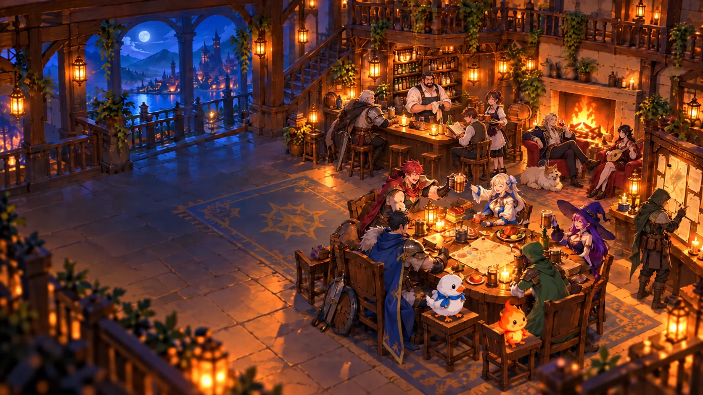
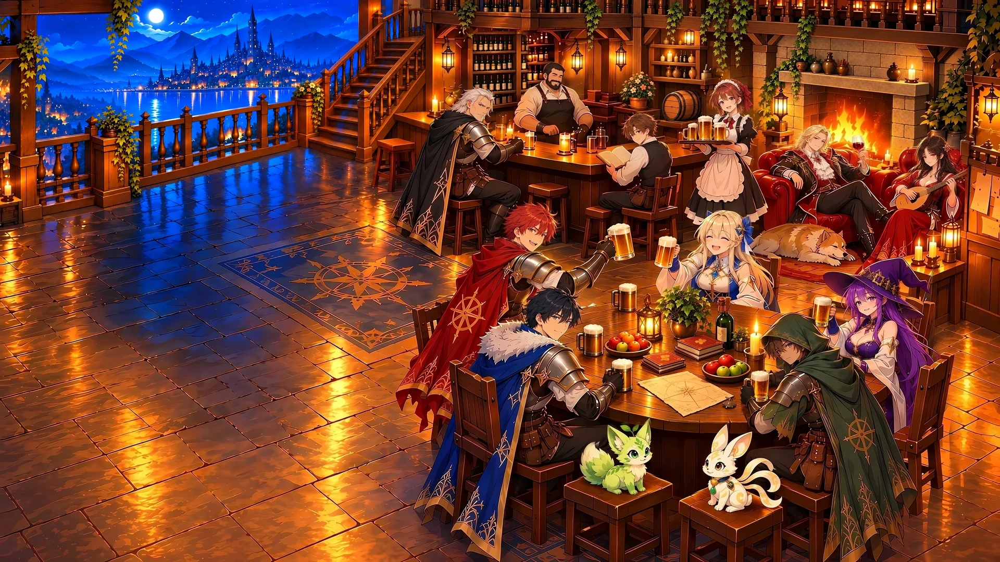

# Image Studio

**Fix, sharpen, or create images with AI, change only what you name, and prove the result is visibly better while the rest stayed the same.**

A plugin of ten skills for Claude Code and Codex, plus a reviewer agent in the Claude Code plugin. It includes no image model: your agent's image tool and a local upscaler draw the pixels, and Image Studio picks the method, checks the result, and decides whether to accept, repair, or stop.

## Skills

| Skill | Does |
| --- | --- |
| `image-inspect` | Diagnoses defects and numbers repeated objects so you can pick a target |
| `image-enhance` | Sharpens or upscales a whole image, cleans jagged or haloed cutout edges, rebuilds a flat logo as vector SVG, removes backgrounds, exports for the web, and proves the gain at display size |
| `image-repair` | Fixes one region through a mask (a face, a prop, a removed person, a logo) and leaves the rest untouched |
| `image-verify` | Reviews each criterion and audits pixels outside the mask |
| `image-create` | Generates new images with a role for each reference |
| `image-loop` | Creates or regenerates a whole image, reviews, and repairs up to three times |
| `image-edit-map` | Builds a numbered map of elements and plans an edit |
| `image-reverse-engineer` | Extracts typography, palette, composition, and lighting to JSON |
| `image-reconstruction` | Splits a reference into parts to recreate or remix it |
| `image-inspiration` | Mixes several references into traceable directions |

The `image-reviewer` agent (Claude Code plugin) grades a candidate independently, so the editing agent does not grade its own work. Other hosts get the same instructions in `image-verify/references/independent-review.md` for a fresh reviewer session.

| Before (1672×941, wrong pets) | After (repainted, upscaled, repaired) |
| --- | --- |
|  |  |

Example: a soft 1672×941 anime tavern hero, where the generator had drawn the wrong pets and off-model faces, was repainted from the approved character and pet sheets, upscaled to 3840×2160, and then repaired one masked region per round (props, stairs, a removed figure), with a pixel compare confirming that everything outside each mask was unchanged. Before/after images, crops, and the rejected attempts are in [examples/image-repair/tavern-hero-case.md](examples/image-repair/tavern-hero-case.md).

## Install

```bash
# Claude Code
claude plugin marketplace add hbui290/image-studio
claude plugin install image-studio@image-studio

# Codex
codex plugin marketplace add hbui290/image-studio
codex plugin add image-studio@image-studio

# Any agent that reads a skills folder (from a clone of this repository)
git clone https://github.com/hbui290/image-studio.git && cd image-studio
python3 scripts/install.py --to <your-skills-directory>
```

Update or remove:

```bash
claude plugin marketplace update image-studio && claude plugin update image-studio@image-studio
claude plugin uninstall image-studio@image-studio
codex plugin marketplace upgrade image-studio && codex plugin add image-studio@image-studio
codex plugin remove image-studio@image-studio
git pull && python3 scripts/install.py --to <your-skills-directory> --replace   # skills-folder install
```

Start a new session afterwards. Invoke a skill by describing the task, or by name: `/image-studio:image-repair` in Claude Code, `$image-studio:image-repair` in Codex, and `/image-repair` or `$image-repair` from a plain skills folder. Use one install method per agent and remove older copies of the same skills. `install.py --replace` deletes the existing folders of these skills, including files you added inside them.

## Tools

Install only what the job needs:

| Job | Needs |
| --- | --- |
| Inspect or plan | Nothing extra; validating an `image-edit-map` or `image-reverse-engineer` spec needs Python with Pillow and jsonschema |
| Crop, mask, composite, export | [ImageMagick](https://imagemagick.org/download/) 7 |
| Sharpen or upscale a whole image | An AI upscaler: [Upscayl](https://github.com/upscayl/upscayl) (ships `upscayl-bin` and models) or [Real-ESRGAN-ncnn-vulkan](https://github.com/xinntao/Real-ESRGAN-ncnn-vulkan) |
| Redraw a missing detail | An image generator or editor available to your agent, plus ImageMagick |
| Background removal | Optional: [rembg](https://github.com/danielgatis/rembg) (`isnet-anime` for illustrations) |
| Logo to vector SVG | Optional: [Potrace](https://potrace.sourceforge.net) |
| Check results | Python 3.9+ with [Pillow](https://pypi.org/project/pillow/); [jsonschema](https://pypi.org/project/jsonschema/) too for `image-loop`'s reviewer and spec validation. Prefix a command with `uv run --with pillow --with jsonschema`, or `pip install pillow jsonschema` into a virtual environment |
| Many objects to select automatically | Optional: [SAM 3](https://github.com/facebookresearch/sam3) through [Transformers](https://huggingface.co/docs/transformers/model_doc/sam3), or rembg's `sam` model |
| Automated vision review through Codex | Optional: [Codex CLI](https://github.com/openai/codex) and a vision model your account can run |

Tested recipes, model choice by image type, and measured results are in [enhancement recipes](plugins/image-studio/skills/image-enhance/references/recipes.md); a pre-flight checklist is in [tool readiness](plugins/image-studio/skills/image-repair/references/tool-readiness.md).

## How checking works

1. Every requested change and every protected region gets an ID and a pass condition.
2. A reviewer marks each ID `pass`, `fail`, or `uncertain`. The reviewer can be the `image-reviewer` agent, a fresh session given the independent review instructions, a Codex vision model, or a person.
3. `audit_candidate.py` compares decoded pixels. A single changed pixel outside the mask rejects the candidate, whatever the reviewer said, and a "passed" change that is barely visible is held for a person to confirm.
4. For whole-image enhancement, `compare_display.py` writes a before/after at display size and fails results that are invisible, not sharper, color-shifted, or no longer faithful to the source.
5. A failure produces a repair prompt with exact source coordinates. The loop stops on uncertainty, on the same failure twice in a row, or at the repair limit. `audit_candidate.py` and `review.py` use the same decisions: see [decisions](plugins/image-studio/skills/image-verify/references/decisions.md). Exit 0 still includes rejections, so read `decision.json` (or `metrics.json` and its `visible_improvement` field for `compare_display.py`).

## Test

```bash
uv run --with pillow --with jsonschema python3 -m unittest discover -s tests
```

Without `uv`, create a virtual environment and `pip install pillow jsonschema` into it. These offline tests call no model and skip themselves when a dependency is missing. They check the logic, not image quality.

## Troubleshooting

- **Skills do not appear:** start a new session; remove older copies of the same skills (another install method, or an old `image-processing` skill).
- **Wrong skill name:** plugin installs use `image-studio:<skill>`; skills-folder installs use the bare name.
- **`stop_provider` from `review.py`:** the Codex reviewer could not run or finish (Codex not installed or not signed in, the model has no vision support or is not available to your account, or the review took longer than `--timeout`, 180 s by default). Use the `image-reviewer` agent or `--report` with a hand-written review instead.
- **No upscaler found:** `image-enhance` stops and says so rather than passing off a sharpen filter; install one from the Tools table.

## Limits

- Vision reviewers can miss small text and fine spatial details.
- Upscalers sharpen detail that exists; they do not recover a face or letter the source never had, and they garble small text.
- A flat image does not reveal its original prompt, fonts, or layers.
- Pixel audits compare 8-bit color and 16-bit grayscale exactly. 16-bit-per-channel color PNG and TIFF files are refused, because Pillow reads them as 8-bit.
- `accepted_by_checks` and `visible_improvement` mean the stated checks passed. They are not human approval.

MIT license. See [NOTICE](NOTICE) for sources.
