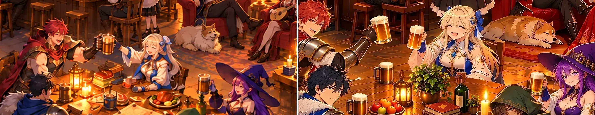
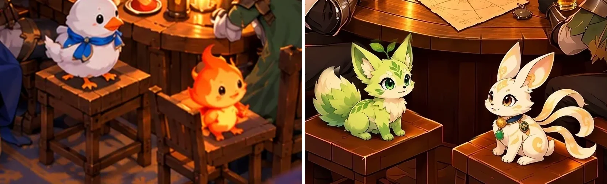
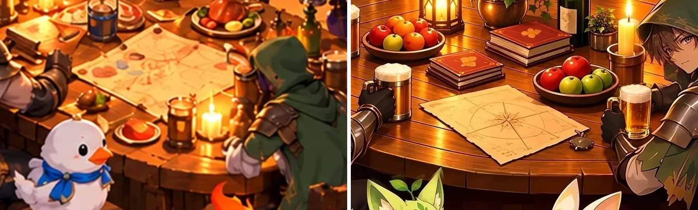

# Case: an AI tavern hero rebuilt, upscaled, and repaired region by region

A real website hero, anonymized. The owner's first image was a 1672×941 anime tavern scene with twelve people, two small pets, and a crowded background. Faces were 20-35 px tall and many props were melted. Over three days it became an accepted 3840×2160 hero. This page records the order of work, including the attempts that were thrown away.

| Before (owner's original, 1672×941) | After (accepted hero, shown here at 1920×1080) |
| --- | --- |
|  |  |

The after image is the version just before a final round that placed a brand mark on the map; that last round is not published here.

## What kind of change this was

This was not a pure enhancement. The owner asked for every character and both pets to match approved character and pet sheets, so the whole frame was repainted on purpose: faces, hair, costumes, both pets, and later the framing itself. The two pets in the original were generator mistakes: the first AI image invented a duck-like pet and a flame creature instead of the approved designs. Attaching the approved pet sheets as references produced the correct fox-like and rabbit-like pets. Only after the content was right was the image upscaled, and then defects were fixed one masked region at a time.

An earlier version of this page said the first image was 1024×576. The files do not support that. The owner's original is 1672×941. The only 1024×576 file is a small web copy of the approved layout made a day later; the early diagnosis probably measured that copy.

## Timeline

| Stage | What changed | Tool |
| --- | --- | --- |
| 1. Original | 1672×941 wide scene, twelve people, two pets drawn wrong by the generator | Owner-supplied |
| 2. Owner variants | Two 2000×1125 variants with the new pets, then a 1672×941 face revision | Not recorded |
| 3. Reference rebuild | Faces, hair, and costumes repainted in three passes of four character sheets each. 3840×2160 was requested; 1672×941 came back | Image generator with reference sheets |
| 4. First 4K | Tone-balanced master upscaled, resampled to 3840×2160 (WebP q90), plus a 2560×1440 copy | Real-ESRGAN `realesrgan-x4plus-anime` ×4, tile 128 |
| 5. Approved layout | New 1672×941 frame: closer camera, larger characters, open balcony on the left. Smaller web copies (1024×576, 1280×720, 2560×1440) followed | Not recorded |
| 6. Face repaint | One whole-scene generation at 1672×941 plus four face tiles, blended with feathered elliptical masks into a 2560-wide image, scaled to 3840×2160. Prompts were not kept | Image generator, ImageMagick composite |
| 7. Resolution pass | 2× to 7680×4320, Lanczos back to 3840×2160, mild unsharp | Real-ESRGAN `realesr-animevideov3` ×2, ImageMagick |
| 8. Local repairs | One masked region per round, listed below | Image generator on crops with reference sheets, ImageMagick masks and composite |

## 1. Diagnose before touching pixels

- Rendered page at 1280×720 and 390×844, plus the file at 100%. CSS had no blur filter; a dark overlay reduced contrast; the real problem was missing detail in tiny faces.
- Rejected: a later whole-frame regeneration (it changed expressions) and a sharpen-only pass (it did not repair malformed details). Once the content is approved and the defects are local, do not regenerate the whole scene again.

## 2. Whole-image enhancement (image-enhance)

Run on the approved 3840×2160 face-repaint image (stage 7):

```bash
realesrgan-ncnn-vulkan -i hero-faces-4k.webp -o hero-2x.png -s 2 -n realesr-animevideov3 -m models
magick hero-2x.png -filter Lanczos -resize 3840x2160! -unsharp 0x0.55+0.5+0.015 -strip -quality 94 hero-restored-4k.webp
```

Cleaner line continuity, but no recovered identity in faces 20-35 px tall. Measured afterwards with `compare_display.py` at 1920 wide: display difference 3.41, sharpness gain 1.138 (limit 1.15), color shift 1.21, fidelity PSNR 29.44 dB. So this step alone just misses the sharpness bar; the visible gains came from the repaints. Always compare eyes, mouths, fingers, and small props with the starting image.

## 3. Local repairs, one region per round (image-repair)

Each round: crop the defect with enough context, send the crop plus the approved character or environment sheet to the image generator, resize the result to the crop size, accept only a feathered mask of it, composite at the crop offset, and compare the rest.

| Round | Crop (w×h+x+y) | Accepted | Rejected first, and why |
| --- | --- | --- | --- |
| Fireplace, lantern, mantel | 1040×1040+2800+0 | Continuous stone courses, four-sided lantern | — |
| Balcony, railing, city | 1100×1100+0+0 | Even posts, coherent joints | — |
| Standing figure at the edge removed | 1024×1536+2816+400 | Wall and floor rebuilt, seated figure kept | Had to be told apart from a similar seated character |
| Two pets | 1200×700+2050+1380 | Both matched their sheets | First mask cut through one ear and ribbon |
| Bar shelves, fireplace, table props | 1120×790+1520+0, 1050×950+2790+0, 920×610+2180+1060 | Bottles, mugs, candles, masonry | Broad table crop shifted props and left double edges; a tighter crop fixed it. First bar mask left half-bottle ghosts |
| Foliage, cask, timber | 970×790+2180+0, 1320×880+0+0, 720×520+2350+1080 | Ivy, shelf brackets, cask, railing, table plants | Generated people and city were not accepted; a broad first mask was narrowed |
| Stairs and balcony posts | 1900×850+0+0, then 1050×680+800+0 | Fewer posts, regular treads, connected landing | — |
| Flower pot | 850×750+2150+0 | Pot replaces climbing ivy | Two ivy fragments left; mask extended |
| Stair entrance | 950×760+800+0 | Open first steps, separate rail end | First candidate kept a post over the steps |
| Open balcony, rail joint | 1650×850+0+0, 600×560+970+240 | Redundant uprights removed, rail joined by a flower pedestal | — |
| Two stray diagonal beams | 1500×1000+0+0 | Two small polygon masks only | — |
| Beer steins | several small crops | Grip matches the handle | A table-steins candidate changed a hand without improving the steins |

The prompt pattern that worked, with images attached:

```text
Image 1 is the existing crop and fixes pose, camera angle, and light.
Image 2 is the approved sheet and fixes identity and design.
Redraw only [the named object] in its existing position and size: [specific corrections].
Keep all other people, animals, clothing, props, text, and perspective unchanged. Add no new subject, label, or logo.
```

The masks, not the prompts, protected the neighbors. Typical final check on the uncompressed composite:

```bash
magick compare -metric AE 'previous.png[2340x2160+1500+0]' 'composite.png[2340x2160+1500+0]' null:   # 0 = untouched
```

A later round put a brand mark on the map. A generated emblem was rejected; the mark was composited from the official file onto paper the generator had cleaned. Never let a model redraw a logo.

## 4. Before and after at 1:1 detail

Made with the repo's own tool. Each crop is the same source-pixel box in both images, with the left side scaled up to the right side's pixel size:

```bash
uv run --with pillow python3 plugins/image-studio/skills/image-enhance/scripts/compare_display.py \
  --source before.webp --candidate after-4k.webp --out cmp --width 1920 \
  --crop 860,340,640,250 --crop 960,660,360,220 --crop 1000,540,330,200
```

Faces (red-haired fighter, blonde healer, witch):



Pets (the generator's wrong pets on the left; the approved fox-like and rabbit-like designs, redrawn from their sheets, on the right):



Table props (map, mugs, fruit, books):



The tool reports `visible_improvement: false`, and that is correct for this case:

| Metric | Value | Limit | Result |
| --- | --- | --- | --- |
| display_difference | 52.234 | ≥ 1.0 | pass |
| sharpness_gain | 2.546 | ≥ 1.15 | pass |
| color_shift | 16.664 | ≤ 3.0 | fail: the lighting and grade were repainted |
| fidelity_psnr | 10.9 dB | ≥ 25.0 | fail: the framing, cast details, and pets were deliberately redrawn |

These gates check enhancement, where content must stay put. A requested repaint fails them by design. Judge a repaint against the reference sheets and by looking at the crops; use the gates on the upscale step alone (section 2).

## 5. A later failure on a different hero, and the rule it produced

A dark painted hero that was already 4K was "repaired" by regenerating a small orb region. The owner saw no difference at display size and asked why the upscaler and segmentation had not been tried. What went wrong: the change was too small to see at 1920 wide, the ellipse mask let the generator redraw a dragon and gold rings inside the orb, and "25% lower pixel error" was reported as if it meant "sharper".

The resulting rules, now enforced by the skills:

- Show a before/after at display size; an invisible change is not an improvement (`compare_display.py`, and the audit holds barely visible changes).
- Try the available upscalers on a crop before deciding they are not needed, and keep only what is visible.
- Protect details inside an edited object with a second mask.
- Report metrics for what they measure.

## 6. Delivery

WebP quality 94 at 3840×2160 (about 1.8-2.3 MB per round), every page reference to the hero updated, page viewed at desktop and 390-wide mobile, build run. The uncompressed composite was the proof of preservation; lossy export changes pixels, so the WebP was only inspected visually. The files in `tavern-hero/` are reduced copies with metadata stripped.
